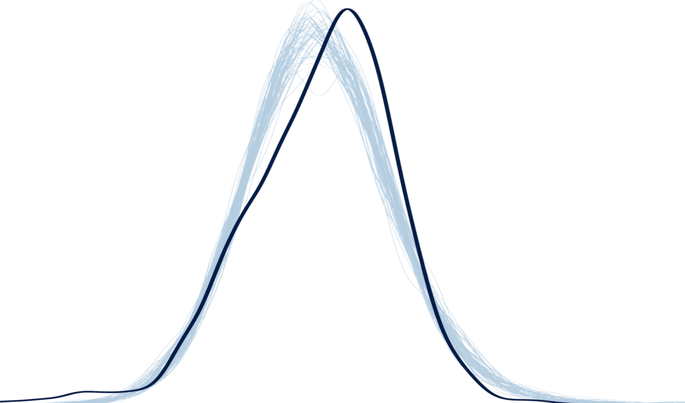

```{r, include=FALSE}
knitr::opts_chunk$set(
  results='asis', 
  echo = FALSE
)
library(tidyverse)
library(glue)

# Set this to true to have links turned into footnotes at the end of the document
PDF_EXPORT <- FALSE

# Holds all the links that were inserted for placement at the end
links <- c()

source('parsing_functions.R')


# First let's get the data, filtering to only the items tagged as
# Resume items
position_data <- read_csv('positions.csv') %>% 
  filter(in_resume) %>% 
  mutate(
    # Build some custom sections by collapsing others
    section = case_when(
      section %in% c('teaching_experience', 'work_experience', 'project', 'volunteer_service') ~ 'positions', 
      TRUE ~ section
    )
  ) 

```


Aside
================================================================================


{width=100%}

Contact {#contact}
--------------------------------------------------------------------------------


- <i class="fa fa-envelope"></i> raven.i.mcknight@gmail.com
- <i class="fa fa-github"></i> github.com/ravenmcknight
- <i class="fa fa-link"></i> [ravenmcknight.com](http://ravenmcknight.com/)
- <i class="fa fa-phone"></i> (828) 776-3258


Interests {#interests}
--------------------------------------------------------------------------------


Spatio-temporal statistics \
Public transit \
Urban planning \
RShiny development \
Reproducible research \
Open source, open data \
Visualization & design \
Civic engagement \


More info {#more-info}
--------------------------------------------------------------------------------

See full CV at [ravenmcknight.com/cv](www.ravenmcknight.com/cv) for more complete list of projects & experience!


Disclaimer {#disclaimer}
--------------------------------------------------------------------------------

Made w/ [**pagedown**](https://github.com/rstudio/pagedown). 

Source code: [github.com/ravenmcknight/cv](https://github.com/ravenmcknight/cv).

Last updated on `r Sys.Date()`.


Main
================================================================================

Raven McKnight {#title}
--------------------------------------------------------------------------------

```{r}
intro_text <- "Statistician and data scientist seeking opportunity to engage in meaningful research & discovery for social good. I have worked on projects with Metro Transit, [Saint Paul City Council](https://www.stpaul.gov/departments/city-council/ward-2/saint-paul-3k-overview), and [The National Gallery of Art](https://www.nga.gov/press/2019/datathon.html).
"


cat(sanitize_links(intro_text))
```


Education {data-icon=graduation-cap data-concise=true}
--------------------------------------------------------------------------------

```{r}
position_data %>% print_section('education')
```


Selected Experience {data-icon=suitcase}
--------------------------------------------------------------------------------

```{r}
position_data %>% print_section('positions')
```


Technical Skills {data-icon=laptop}
--------------------------------------------------------------------------------


|                               R, Shiny, ArcGIS, QGIS, Git, LaTeX, bookdown/blogdown, Python, SQL
|                               Stan, JAGS, Leaflet, Excel, Hugo, Jekyll, Django, Netlify,  Adobe Illustrator, 
|                               InDesign, & Photoshop


